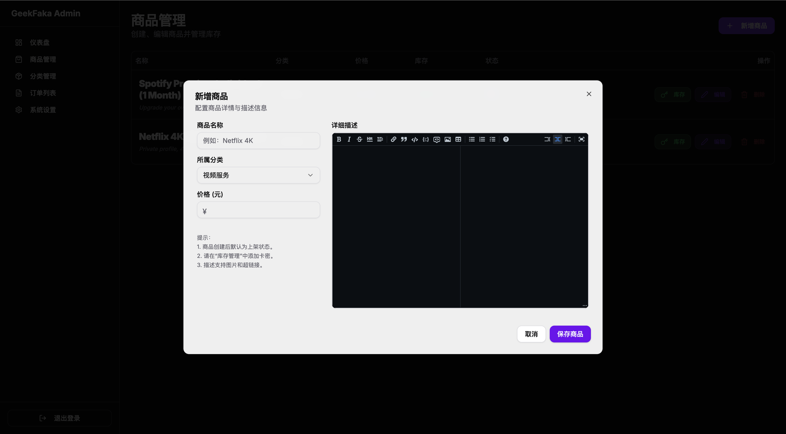
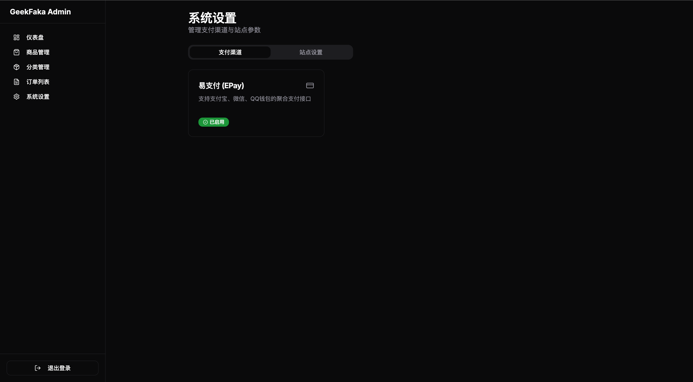
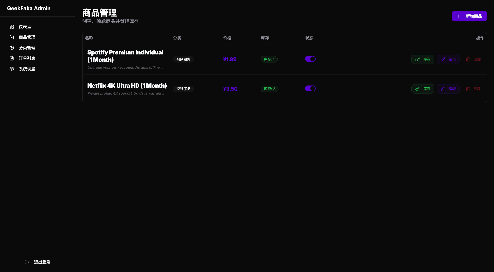
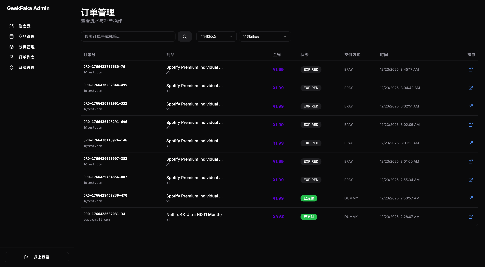

# GeekFaka - 极客发卡系统

它专为独立开发者、创作者和数字商品卖家设计，提供从商品展示、下单购买、支付对接（易支付/支付宝/微信）到自动发货的完整闭环。

## 📸 界面预览

| 前台首页 (Dark Mode) | 沉浸式购买弹窗 |
| :---: | :---: |
|  |  |

| 商品管理 (Markdown编辑器) | 系统设置 (在线配置) |
| :---: | :---: |
|  |  |

| 商品列表 | 订单查询 |
| :---: | :---: |
|  |  |

## ✨ 核心特性

- **🚀 双模式架构**：开发/轻量部署支持 **SQLite**，生产环境支持 **MySQL/PostgreSQL**。
- **🐳 Docker 一键部署**：内置 Dockerfile 与 Docker-compose，5分钟内完成生产环境搭建。
- **🎨 极客 UI**：极致深色模式，左右分栏设计，磨砂玻璃质感，适配大屏操作。
- **💳 支付网关**：内置 **易支付 (EPay)** 适配器，支持 MD5 和 **RSA 高安全签名**。
- **⚙️ 在线配置**：支付参数、站点信息、管理员密码均可在后台动态修改，无需改码。
- **📝 Markdown 支持**：商品描述支持 Markdown 编辑与渲染，图文并茂展示商品。

## 🚀 快速开始

### 方式 A：Docker 部署 (推荐生产环境)

这是最简单且最安全的方式，自动配置 MySQL 环境。

1. **下载项目**：
   ```bash
   git clone https://github.com/huangzijian888/GeekFaka.git
   cd GeekFaka
   ```

2. **配置参数**：
   修改 `docker-compose.yml` 中的环境变量，特别是 `MYSQL_PASSWORD`、`DATABASE_URL` 和 `NEXT_PUBLIC_URL`。

3. **启动系统**：
   ```bash
   docker-compose up -d
   ```
   访问 `http://localhost:3000` 即可开始使用。

---

### 方式 B：本地源码运行 (适合开发/预览)

1. **安装依赖**：
   ```bash
   yarn install
   ```

2. **环境配置**：
   复制 `.env.example` 为 `.env`：
   ```env
   DATABASE_URL="file:./dev.db"
   ADMIN_PASSWORD="admin"
   NEXT_PUBLIC_URL="http://localhost:3000"
   ```

3. **初始化数据库**：
   ```bash
   npx prisma migrate dev --name init
   ```

4. **启动开发服务器**：
   ```bash
   yarn dev
   ```

## 📖 管理手册

### 后台入口
- 地址：`/admin`
- 初始密码：查看你的环境变量 `ADMIN_PASSWORD` (默认 `admin`)。

### 支付对接 (易支付)
1. 进入“系统设置” -> “支付渠道”。
2. 点击“易支付”。
3. 勾选实际支持的子渠道（支付宝/微信/QQ/USDT）。
4. 设置手续费率（仅用于前端展示，不影响实际传参金额）。
5. 填入 API 地址、PID 和 Key/RSA 密钥并保存。

### 数据库切换
本项目基于 Prisma，如需手动将 SQLite 切换为 MySQL，请修改 `prisma/schema.prisma` 中的 `provider = "mysql"` 并运行 `npx prisma migrate dev`。在使用 Docker 镜像时，系统会自动完成此转换。

## 🤝 参与贡献

欢迎提交 Issue 和 Pull Request！

## 📄 开源协议

本项目采用 [MIT License](LICENSE) 开源。